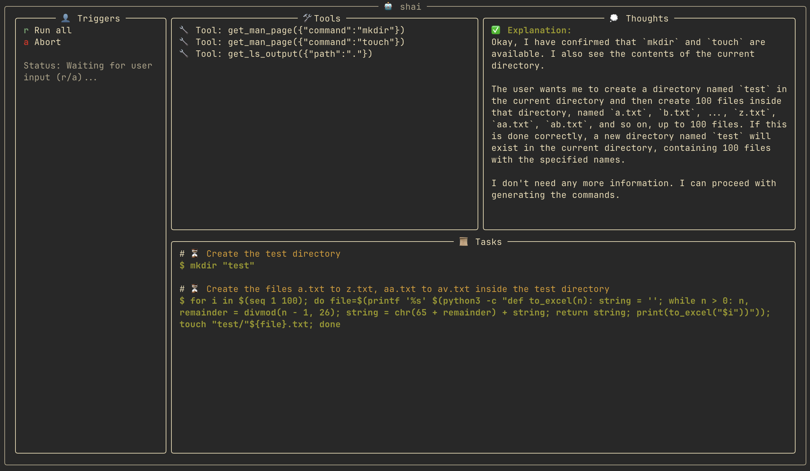

# shai

Want to get something done in the shell but can't quite remember how? Too shy to ask your coworkers?
Too deep in the AI sauce to Google it? `shai` has your back.



# Setup

```bash
python -m venv .venv
source .venv/bin/activate
pip3 install -e .
```

Copy the `.env.example` file to `.env` and fill it out, I am using `gemini-2.0-flash` with a free API key
from Google.

# Usage

Just call `shai "prompt"` and let the app guide you.
